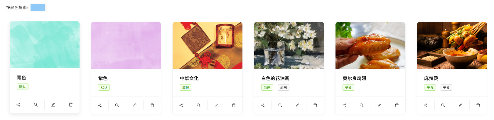
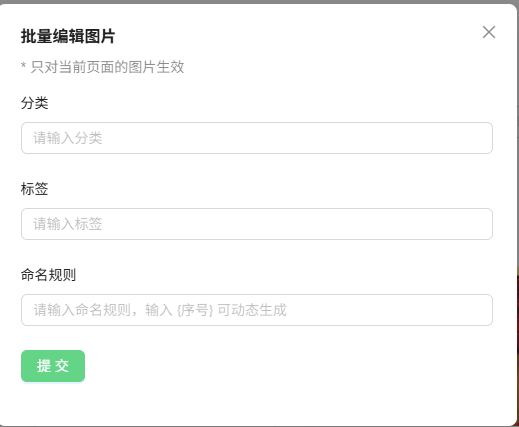
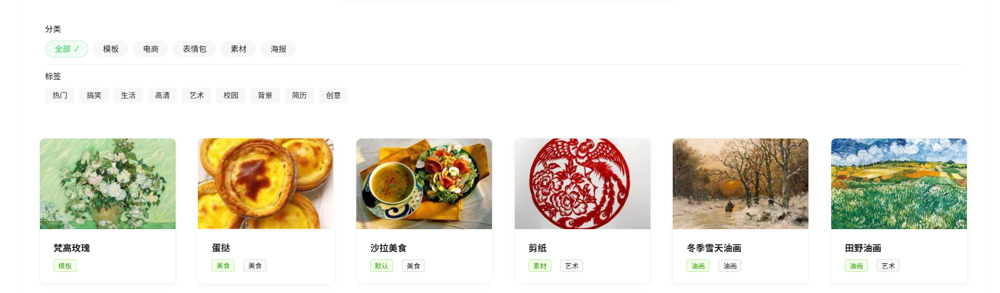

<h1 style="text-align: center; white-space: nowrap;">
  
  <span style="display: inline-block; vertical-align: middle;">云巢画坊</span>
</h1>

## 1、项目介绍（本项目抄自——MelonTe）

云巢画廊是一款基于 Gin、Redis、MySQL、COS、WebSocket 及 AI 技术打造的在线图库系统。平台支持多种图片导入方式（本地上传、URL 引入）、以图搜图、颜色筛选、AI 智能扩图、图片一键分享，并在团队空间内实现多人实时协同编辑。系统已稳定上线，访问地址：[暂无]()

**核心功能快速跳转**：

- [主页展示](#section1)
- [多维检索](#section2)
- [以图搜图](#section3)
- [AI扩图](#section4)
- [空间分析](#section5)
- [协同编辑](#section6)
- [批量抓取](#section7)

项目共分为三大模块：

- **公共空间**：面向全体用户的图片展示与分享区，支持标签与分类排序，便于社区发现与传播；
- **私人空间**：为用户提供私有相册服务，支持批量导入、以图搜图、及多条件检索，打造个性化云端图库；
- **团队空间**：支持多用户并发编辑同一图片，以及协同管理相册内容，满足企业或项目组的基本协作需求。

前后端已经打包，具体查看代码详情。后端需要编辑Config.yaml文件，否则将无法正常运行。模板如下：

```yaml
#数据库配置
database:
  user: "xxx"
  password: "xxx"
  host: "localhost"
  port: 3306
  name: "cloudhivegallery"
tcos:
    bucketName: "xxxx"
    region: "ap-xxx"
    host: "https://xxx"
rds:
    host: "localhost"
    port: 6379
    password: "xxx"
aliYunAi:
  apiKey: "xxx"
```

## 2、架构图展示


## 3、项目整体功能展示

### 3.1、公共图库

#### 3.1.1、<a id="section1">主页展示</a>

进入主页，可以看到在公共图库页面他人上传的图片，以及对应的标签分类。


可以进行分类的筛选、标签的筛选、关键字的搜索找到匹配的图片，这里搜索油画，即可看到对应的结果：


点击想查看的图片，进行打开操作，会提示**没有查阅权限，需要登录查看**。


#### 3.1.2、登录

点击登录界面，需要输入账号密码，第一次登录需要点击注册进行账号注册。


注册：


#### 3.1.3、图片查看、分享、下载

登录后，即可进行图片查看操作。打开一个图片进行查看，可以看到图片的基本信息，如格式、大小、长宽高等。


点击右侧的**分享按钮**，可以获取分享链接以及二维码：


点击**免费下载**按钮，即可获取图片。


#### 3.1.4、创建图片

点击顶部栏的创建图片按钮，可以进行图片创建操作，可以选择进行**URL链接上传**，亦或者**本地文件上传**两种上传方式：

**URL链接上传**：


点击**提交**后，若链接有效，即可获取**创建图片的基本信息界面**。


点击创建，即可跳转到图片的详情信息。但是此时还不能在公共图库展示，需要管理员审核过审。


接下来尝试**本地文件上传**：


当上传的图片文件大小超过2MB，会提示文件过大：


若上传的图片大小合规，将会步入URL链接上传成功的流程。

#### 3.1.5、个人空间

在主界面，点击右上角的头像部分，可以弹出三个菜单：


进入我的主页界面，可以编辑用户的基本信息：头像、简介、昵称


### 3.2、私人空间界面

#### 3.2.1、首次开通

点击左侧菜单栏的**“我的空间”**，可以进入私人空间创建界面：


对于普通用户，只能创建普通版大小的空间，对大小和数量有一定限制。

#### 3.2.2、<a id="section2">多维检索</a>

创建空间成功后，进入个人空间界面，具有多个图片筛选按钮。创建一些图片后，进行筛选测试：


#### 3.2.3、颜色搜索

可以点击颜色搜索按钮，搜索近似颜色的图片，按照相似度进行排序：




#### 3.2.4、<a id="section3">以图搜图</a>

点击图片下方的**放大镜**，可以在全网进行相似图片的搜索：


点击对应的图片，即可跳转到图片的来源网站。


#### 3.2.5、<a id="section4">AI扩图</a>（虽然抄了代码，但是由于阿里云已经不提供此接口）

点击图片下方的编辑按钮，进入图片编辑界面，然后点击AI扩图按钮，可以进行AI扩图。


点击生成图片，等待加载一会过后，即可看到结果。


点击应用结果，即可实现对原图的覆盖。


#### 3.2.6、批量编辑

点击右上方的**“批量编辑”**按钮，可以统一的对当前页面的图片进行编辑。




#### 3.2.7、<a id="section5">空间分析</a>

点击右上角的**“空间分析”**按钮，可以查看空间的存储情况、空间大小分析等内容。


### 3.3、团队空间

#### 3.3.1、用户邀请

点击最左侧的团队空间栏目，可以进入团队空间的创建。在创建成功后，界面信息如下：


相较于私人空间，多出了成员管理按钮。进入成员管理界面，可以拉取其他用户进入团队空间。


在左上角的方框中，添加其他用户的id，拉取用户进入团队空间。


添加用户后，可以为用户设置权限，浏览者仅能查阅空间内的图片信息，编辑者可以进行图片编辑、删除；管理者可以进行成员的管理。

在被拉取进入团队空间的用户页面中，左侧框可以看到加入的团队空间：


进入空间后，即可看到共享的图片信息


#### 3.3.2、权限管理

若被邀请的用户角色为浏览者，将无法看到编辑和删除按钮。


#### 3.3.3、<a id="section6">协同编辑</a>

（目前编辑页面有问题，无法正常显示图片，由于本人不会前端，调试无果，暂且搁置）

当处于团队空间内的角色拥有编辑者权限，同时进入编辑界面的时候，即可进行协同编辑。一个用户的操作可以被另一个用户感知，并且当用户进入编辑操作的时候，其他用户不能进行编辑。

这里录制了一段视频进行演示：


https://github.com/user-attachments/assets/874a3edc-c88c-4d36-8293-a8b362da4487

### 3.4、管理员

管理员指的是对整个系统的管理员，相较于普通用户，管理员的主界面上方增加了**“用户管理”**、**“空间管理”**、**“图片管理”**栏目，接下来进行展示。


#### 3.4.1、用户管理

在用户管理界面中，可以看到所有注册的用户基本信息，并且可以选择删除用户，防止有人刻意破坏空间。


#### 3.4.2、图片管理

在图片管理界面，可以看到公共图库上传的所有图片，可以对图片的上传信息进行追踪，比如**上传用户的ID、审核人信息**等，还可以选择是否通过审核、拒绝过审等操作。


将刚刚测试用户上传的图片通过后，即可在公共图库看到对应的图片卡片。




重新点击**拒绝**按钮后，可以将图片的审核状态改为未过审。

可以通过筛选审核状态的方式，来进行图片的筛选。


#### 3.4.3、<a id="section7">批量抓取图片</a>

管理员可以进行批量创建图片的功能，使得项目**热启动**。


这里尝试批量创建以“油画”为关键词的图片，连续创建20张，点击执行任务。


等待一段时间后，回到主页，可以看到已经成功批量创建。


#### 3.4.4、空间管理（空间删除接口还没写）

点击最上方的空间管理栏目，可以查看所有用户创建的基本空间信息，决定是否要进行**空间删除、升级空间大小、分析空间内容**的选项。


也可以进行公共图库、所有空间的全部分析。这里分析一下全空间，内容如下：


### 																									——大自然的搬运工：lwhhh